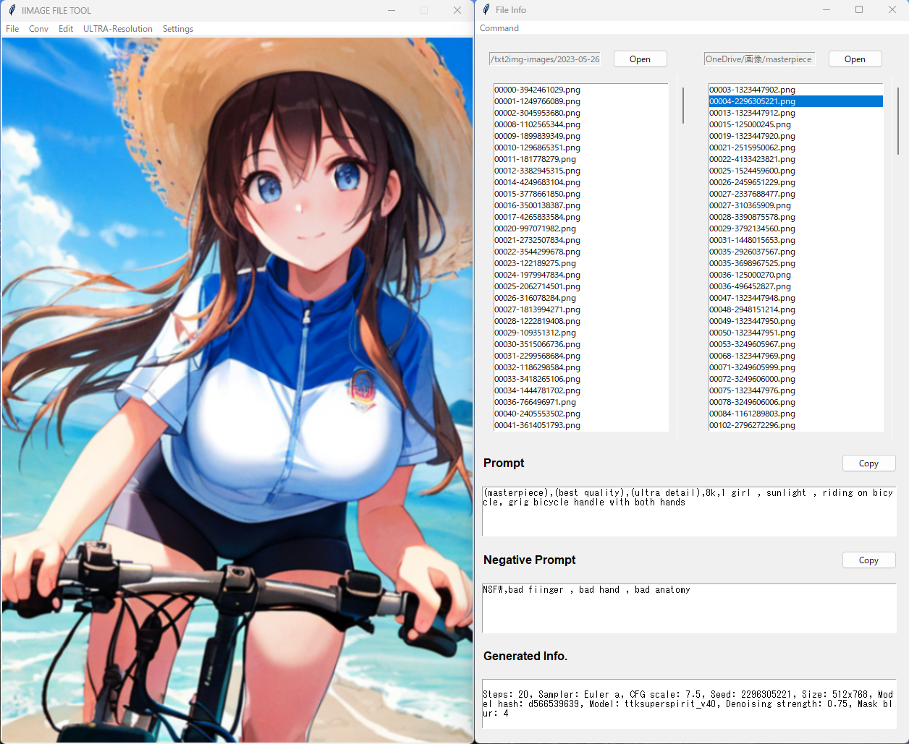
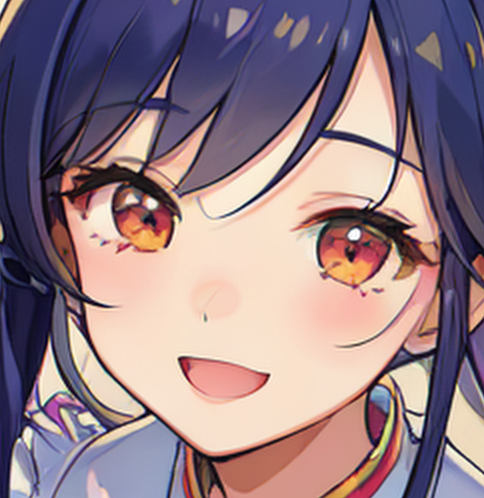
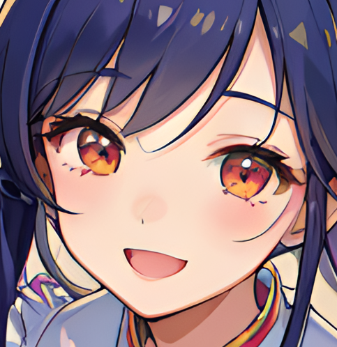

# Usage
pythonw.exe Image.pyw

For those using AUTOMATIC1111, please associate /stable-diffusion-webui/venv/Scripts/pythonw.exe and Image.pyw in the stable-diffusion-webui folder as default programs and run them. Creating a shortcut for Image.pyw and placing it on the desktop will make it more convenient.

or obtain Image.exe from the Google Drive below.(Howeve this Executable file is Version 1.7)

# Function Description #
This app is a tool for managing files created in large quantities by StableDiffusion (AUTOMATIC1111). It also has simple image editing functions. It does not work on Mac. It extracts image generation information embedded in PNG files. It is a fast and efficient image viewer. Unwanted works can be deleted with the Delete key. You can send image files to your favorite folder using the right arrow key. You can switch images using the up and down arrow keys. The information of the source folder and destination folder, once loaded, is recorded in a file and will be automatically loaded in subsequent sessions.

Known Issue: The deleted files in the Explorer are not reflected in the list box. Please just reload App.

* Version 2.7
I have implemented a prompt generator. Please customize 'prompt.txt' as desired.

* Version 2.6
I have made it possible to compress the files in the left list box into a ZIP file. Please note that only image files are displayed in the list box, so please check in the explorer if you need to compress other types of files. Also note that PNG files are already heavily compressed, so there will be no change in size between the original image and the compressed file.

* Version 2.5
I added a halftone feature. I referenced this research page. https://imageprocessing-sankarsrin.blogspot.com/2018/05/bayers-digital-halftoning-dispersed-and.html

* version 2.4
I added a feature to convert to ASCII art and display it in a separate window.(It is necessary to have Courier New font installed.)

* Version 2.3
I added a contrast adjustment feature.

* Version 2.2
Added HSV adjustment feature.

* Version 2.1
I made it possible to select R-ESRGANx2 and x4 for super resolution conversion. When you press the RIGHT KEY, a confirmation message box will appear (can be disabled from settings).

* Version 2.0
I have enabled the user to specify the area to apply the mosaic effect using a rectangle. Additionally, I have improved the UI and added two buttons to open a folder.

* Version 1.9
I have made Real-ESRGAN available in addition to CRAN V2 for upscaling images up to twice their original resolution. Even low-resolution images can be upscaled to ultra-high resolution. Both conversion algorithms will run slowly without CUDA. Please note that the author is completely ignorant of machine learning and the code is copy-pasted. The original repository can be found here.

https://github.com/ai-forever/Real-ESRGAN

* Version 1.8(β Version)  
I have added an experimental feature to upscale images using super-resolution. Please note that this process can be very slow without a GPU and there may be some noise in the output. This feature is strictly experimental. Please make sure to place Common.py, Models.py, and CARN_model.pt in the same directory as Image.py before running it. Also note that the program has not been converted to an executable file yet.    

* Version 1.7(Stable Version)  
I have merged the four windows into two. I have fixed a critical bug where file selection was incorrect. I have also updated the UI to be entirely in English.

* Version 1.6
I have created a destination window for file transfer. Now, you can send files using the "→" button. I have also implemented the functionality to open the currently displayed image file in the File Explorer. Additionally, I have enabled the main window's image to be zoomed in by 1.05 times when left-clicked. Various bugs have been fixed as well.

* Version 1.5
    Added support for stable diffusion(Automatic1111). Display prompt and image generation information for PNG files. Added clipboard copying functionality.

* Version 1.4
    Add cropping feature

* Version 1.3
    Adding sepia tone conversion functionality.
    Adding flip feature.

* Version 1.2
    convert Gray_scale feature addition
    
* Version 1.1
    Gamma correction feature addition

* Version 1.0
    Version 1.0 is a tool that allows you to draw and delete a large number of image files. It comes with features such as hue conversion, blur, mosaic, resize, and pencil sketch. 
    You can use the up and down buttons to select and draw files. Press the Delete key to delete files. 
    It also has real-time monitoring of image files that are generated automatically by AI and continue to accumulate.

***
# アプリ概要
ファイラー機能（ファイルの削除、移動、圧縮、生成リアルタイム監視機能）

画像加工機能（ガウシアンぼかし、ガンマ補正、鉛筆画、RGB調整、HSV調整、コントラスト調整、モザイク加工（矩形指定可）、トリミング、グレースケール変換、セピア調変換、ハーフトーン変換、ミラー変換）

超解像度アップスケーラー(CranV2 , RealESRGAN)

プロンプトジェネレーター（リストから指定するだけ）

アスキーアート作成機能

画像クリップボード機能（貼り付け、コピー）

* バージョン1.1　- ガンマ補正機能追加

* バージョン1.2　- グレースケール変換機能追加

* バージョン1.3　- セピア調変換、ミラー変換機能追加

* バージョン1.4　- トリミング機能の追加（トリミングの選択で画像左クリック＆ドラッグが有効化）

* バージョン1.5　- Stable Diffusion(Automatic1111)に対応。PNGファイルからプロンプト、生成情報を抽出、表示、クリップボードへ送る機能を追加。
メインウインドウ以外を非表示にする機能を追加。

* バージョン1.6 - ファイルの転送先のウインドウを作成しました。→ボタンで送ることができるようになりました。
現在表示中の画像のファイルをエクスプローラーで開くことができるようにしました。
プロンプト、ネガティブプロンプト情報をクリップボードに送るボタンを設置しました。
メインウインドウの画像を左クリックすると1.05倍づつ拡大するようにしました。リストボックスと送り先フォルダ（お気に入り？傑作？）の情報は"dir_config.ini"というファイルに記録されるので
次回の起動時にいちいちフォルダを指定する必要がありません。その他バグを修正しました。

* バージョン1.7 - 4つあったウインドウを統合し2つにしました。ファイルの選択がずれている重大なバグを修正しました。UIを全て英語表記にしました。

* バージョン1.8　- 実験的に超解像度にアップスケールする機能を追加しました。GPUがないとすごく時間がかかるのでお勧めしません。ノイズが混じることがありあくまでも実験的なものです。Exe化はしていません。Common.py , Models.py , CARN_model.ptをImage.pyと同一フォルダに配置して実行してください。
 
* バージョン1.9　- 超解像度二倍までのアップスケールにCRAN V2の他にReal-ESRGANを利用できるようにしました。
低解像度の画像でも超高解像度でアップスケーリングが可能です。
CUDAが使えないとどちらの変換アルゴリズムでも低速です。なお作者は機械学習に全く無知なためコードはコピペです。
AUTOMATIC1111で低解像度で生成された作品もかなりきれいにアップスケーリングできます。
フォルダ構成はリポジトリのままにしてください。
 
* バージョン2.0　- モザイクを掛ける範囲を矩形で指定できるようにしました。UIを改善しフォルダを開くボタンを追加しました。

* バージョン2.1　- RealESRGANによる超解像度変換にR-ESRGANx2とx4を選択できるようにしました。
2倍以上に拡大する場合はx4の方がいいかもしれません。（よくわかってない）
→ボタンを押したとき確認メッセージボックスを出すようにしました。（Setttingsから無効にできます。）

* バージョン2.2　- HSV調節（色相、彩度、明度調節）機能を追加しました。

* バージョン2.3　- コントラスト調節機能を追加しました。

* バージョン2.4 - アスキーアートに変換して別ウインドウで表示する（無駄な）機能を付けました。変換エンジンとカラーセットがセンスがなく仕上がりはお察しです。
Courier Newフォントがインストールされていないとデフォルトのフォントが多分選択されるので画像が崩れます。
（WindowsだとCourier Newはプリインストールされてる...と思う。）

* バージョン2.5 - ハーフトーン機能の追加（2種類ありますが重ね掛けはできません。Undoしてから選択しなおしてください）

* バージョン2.6 - ZIPファイルに圧縮する機能を追加しました。

* バージョン2.7 - プロンプトジェネレーターを実装しました。'prompt.txt'は自分でカスタマイズできるようになっているので自分の使いやすいようカスタマイズしてください。使い方は使っていれば分かります。
 

* 必要な追加ライブラリのインストール：python.exe -m pip install -r requirements.txt

* 実行ファイル(Version1.7):https://drive.google.com/file/d/1PQ4PhxMu0VRu1GH2LUvx2tiS7RqotvnA/view?usp=sharing

AUTOMATIC1111を使っている方はstable-diffusion-webuiのフォルダから/venv/Script/pythonw.exeとImage.pywを関連付けて既定のプログラムとし実行してください。
Image.pywのショートカットを作成しデスクトップに置けばはかどります。

アプリの画面

拡大アルゴリズム　ESRGANの方が輪郭がよりシャープになります。
| LANCZOS | R-ESRGAN |
| --- | --- |
|  |  |
